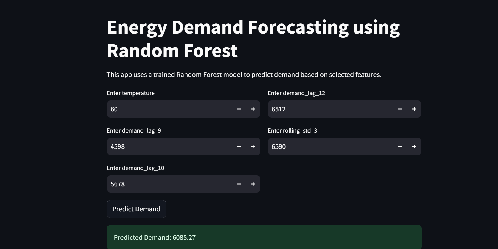

# Electricity-Demand-Forecasting-Time-Series-Analysis
Accurate electricity demand forecasting is critical for efficient resource planning and management. This project explores and compares different time series forecasting approaches like statistical method, machine learning, and deep learning techniques to predict the average demand using historical data and related features.

## Objective 
The objective is to build and evaluate forecasting models that predict future average hourly electricity demand based on past consumption, temperature, and derived lagged features. The project compares:

- ARIMA - a classical statistical model suited for stationary time series
- Random Forest Regression - a tree-based ensemble method using engineered features
- LSTM - a deep learning model capable of capturing complex temporal dependencies

Following model comparison, the best-performing model is deployed as an interactive web application for real-time predictions.

##  Data and Feature Engineering
- Used historical energy demand data combined with temperature readings.
- Created lag features from 1 to 12 previous time steps to capture temporal patterns.
- Computed rolling statistics (window size 3) for smoothing trends.
- Included calendar features such as month
- Applied feature selection using Random Forest feature importances to reduce overfitting and improve model interpretability.

  ## Smoothing techniques
- Simple Moving Average
- Weighted Moving Average
- Exponential Moving Average
- Exponential Smoothing

## Models and Training
- **ARIMA**: Used auto_arima which automates differencing, identification of AR and MA terms and seasonal components.
- **LSTM**: Built a sequential model with two LSTM layers, LeakyReLU activations, and dropout to prevent overfitting; input sequences formed via sliding window of length 12.
- **Random Forest**: Trained on lagged features, temperature, and rolling statistics; hyperparameter tuning done using GridSearchCV with time series split cross-validation.

## Model Evaluation
Models were evaluated using:
- RMSE (Root Mean Squared Error)
- MAE (Mean Absolute Error)
- MAPE (Mean Absolute Percentage Error)

## Model Performance

|       Model        |      RMSE        |      MAE        |     MAPE      |
|--------------------|------------------|-----------------|---------------|
| **ARIMA model**    |   399.361793     |   258.673905    |   4.096961    | 
| **Random Forest**  |   190.023463     |   157.172439    |   2.520076    | 
| **LSTM model**	    |   382.603194	    |   248.815227    |	  4.032997    |

Random Forest achieved the best performance across all metrics, demonstrating robust generalization and lower forecast errors.

## Deployment

## Dive Deeper into the Project  
Curious to see the **complete breakdown** of the model pipeline, Exploratory data analysis, visual results, and insights?
 I’ve documented everything in a blog post with visuals and intuition explained - perfect for beginners and ML enthusiasts!

📬 **Check out my full blog here**:  

## Let's Connect!

I'm always open to collaboration, discussion, or just a quick chat about AI and Machine Learning! Feel free to reach out:

  
  &nbsp;
  
  &nbsp;
  

